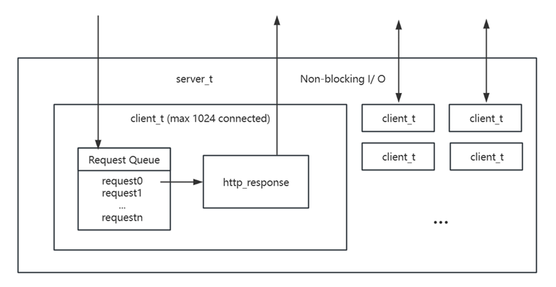

# Socket Programming

This project is based on **CMU 15-441/641 Networking and the Internet Project 1: A Web Server Called Liso**.

## Structure


## Installation
1. Build the Docker image:
   ```bash
   docker build -t 15-441/641-project-1:latest -f ./DockerFile .
   ```
2. Run the Docker container:
   ```bash
   docker run -it -p 9999:9999 -v `pwd`:/home/socketProgramming/ --name <container_name> socketProgramming /bin/bash
   ```
3. Clone this repository and build:
   ```bash
   git clone https://github.com/catcat-dogdog/socketProgramming.git
   make
   ```

## Usage
1. Start the server:
   ```bash
   ./server.sh
   ```
2. Open another terminal, navigate to the project directory:
   ```bash
   cd /home/socketProgramming/
   ```
3. Run a test HTTP request using the echo client:
   ```bash
   ./echo_client <a_http_request>
   ```
4. You can also test the server by opening a browser and visiting:
   ```
   http://localhost:9999
   ```

